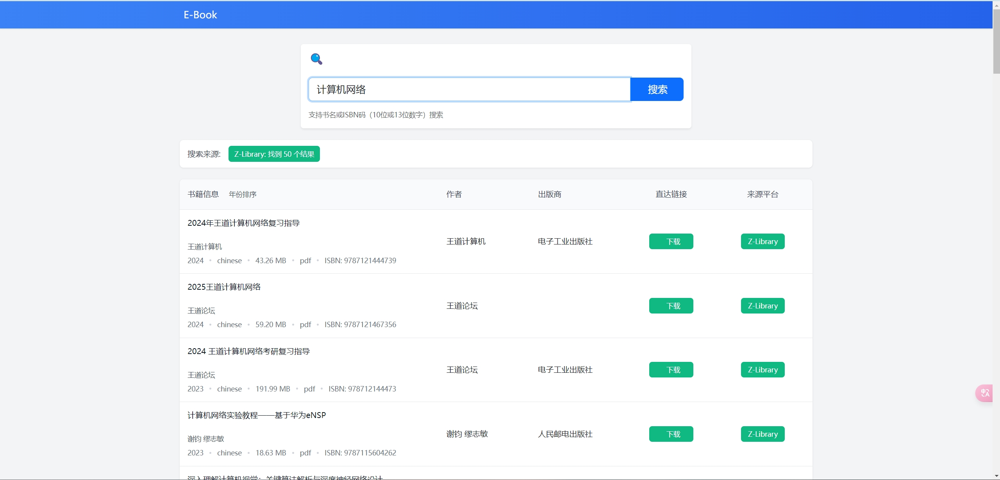

# E-Book Search 项目

这是一个基于Vue.js和Flask的电子书搜索系统。

支持多种搜索平台，包括zlibrary等等。

## 项目结构

```
- frontend/  # 前端Vue.js项目
  - dist/    # 构建后的静态文件
- backend/   # 后端Flask项目
  - app/     # Flask应用
  - platforms/ # 搜索平台实现
  - utils/   # 工具函数
```

## 部署说明

### 环境要求

- Python 3.12+
- Node.js 14+

### 后端部署

1. 创建并激活Python虚拟环境：
```bash
python -m venv .venv
.venv\Scripts\activate  # Windows
source .venv/bin/activate  # Linux/Mac
```

2. 安装依赖：
```bash
pip install -r backend/requirements.txt
```

3. 启动后端服务：
```bash
cd backend
python app.py
```

### 前端部署

前端已经构建完成，静态文件位于 `frontend/dist` 目录下。你可以：

1. 直接使用Web服务器（如Nginx）托管 `frontend/dist` 目录
2. 或者使用Python的HTTP服务器快速预览：
```bash
python -m http.server 8080 --directory frontend/dist
```

## 访问应用

- 前端页面：http://localhost:8080
- 后端API：http://localhost:5000

### CentOS系统部署指南

1. 安装Python 3.12+：
```bash
# 安装依赖
sudo yum update -y
sudo yum groupinstall "Development Tools" -y
sudo yum install openssl-devel bzip2-devel libffi-devel -y

# 下载并安装Python 3.12
wget https://www.python.org/ftp/python/3.12.0/Python-3.12.0.tgz
tar xzf Python-3.12.0.tgz
cd Python-3.12.0
./configure --enable-optimizations
sudo make altinstall

# 验证安装
python3.12 --version
```

2. 安装pip和虚拟环境：
```bash
python3.12 -m pip install --upgrade pip
python3.12 -m pip install virtualenv
```

3. 克隆项目并设置环境：
```bash
# 克隆项目（如果使用git）
# git clone <项目地址> zlib
# cd zlib

# 创建并激活虚拟环境
python3.12 -m venv .venv
source .venv/bin/activate
```

4. 安装项目依赖：
```bash
pip install -r backend/requirements.txt
```

5. 启动后端服务：
```bash
cd backend
python app.py
```

6. 部署前端：
```bash
# 使用Python的HTTP服务器快速预览
python -m http.server 8080 --directory frontend/dist

# 或者安装并配置Nginx
sudo yum install nginx -y
sudo vi /etc/nginx/conf.d/ebook-search.conf
```

Nginx配置示例：
```
server {
    listen 80;
    server_name your_domain.com;  # 替换为你的域名或IP

    location / {
        root /path/to/zlib/frontend/dist;  # 替换为实际路径
        index index.html;
        try_files $uri $uri/ /index.html;
    }

    location /api/ {
        proxy_pass http://localhost:5000/;
        proxy_set_header Host $host;
        proxy_set_header X-Real-IP $remote_addr;
    }
}
```

7. 启动Nginx：
```bash
sudo systemctl start nginx
sudo systemctl enable nginx
```

## 注意事项

1. 确保后端API地址在前端配置正确（vue.config.js中）
2. 建议在生产环境中使用正式的Web服务器（如Nginx）来托管前端静态文件
3. 可以根据需要修改后端服务的端口号和其他配置
4. CentOS系统中可能需要配置防火墙以允许访问相应端口：
```bash
sudo firewall-cmd --permanent --add-port=5000/tcp  # 后端API端口
sudo firewall-cmd --permanent --add-port=8080/tcp  # 前端页面端口
sudo firewall-cmd --reload
```

## 前端演示
